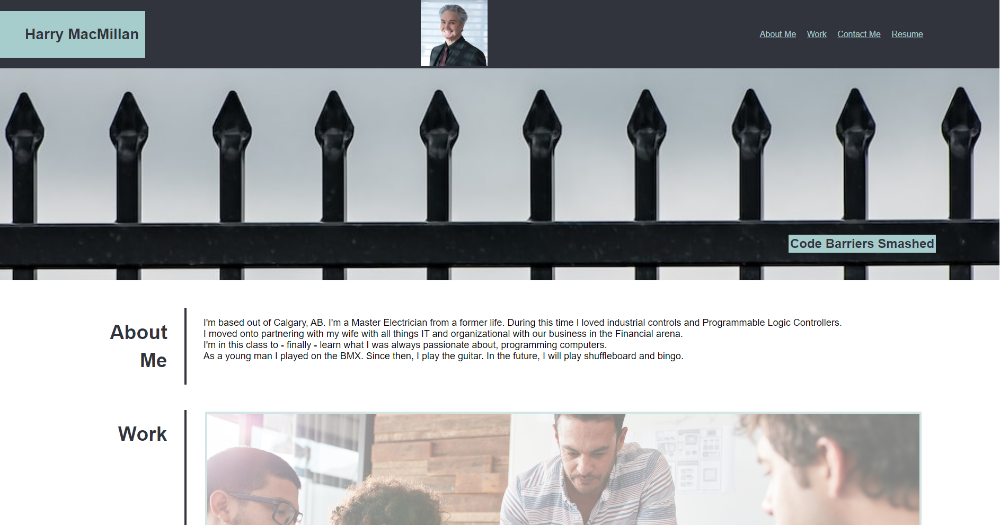

# Code Refactor Starter Code

## Description

The intent of this project is to have a repository for potential employers and admirers alike to view my projects.
The unfocused items have a reduced opacity for aesthetics.

## Installation

Repository location:        https://github.com/harrymac1972/m2_challenge_b.git

In Git Bash please type use:    git clone https://github.com/harrymac1972/m2_challenge_b.git    once in your folder of choice

## Usage

## Credits

Resources:

    https://www.w3schools.com/html/html5_semantic_elements.asp

    https://www.codecademy.com/resources/blog/semantic-html/

